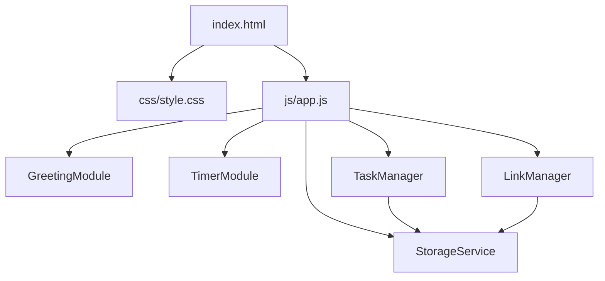

# Design Document

## Overview

The vanilla-web-app is a single-page personal dashboard built with plain HTML, CSS, and JavaScript — no frameworks, no build step, no backend. It runs entirely in the browser and uses `localStorage` for persistence.

The app is composed of four independent modules rendered on one page:

1. **Greeting Module** — live clock, date, and time-based greeting
2. **Focus Timer** — 25-minute Pomodoro-style countdown
3. **Task Manager** — to-do list with create, edit, complete, and delete
4. **Link Manager** — quick-access saved links

All persistent state (tasks, links) is serialised as JSON and stored in `localStorage` via a shared `StorageService`.

---

## Architecture

The app follows a simple module pattern with no external dependencies. Each module is a self-contained JavaScript object/class that owns its DOM section and interacts with `StorageService` for persistence.



**File structure:**
```
index.html
css/
  style.css
js/
  app.js
```

All JavaScript lives in `js/app.js`, initialised via a `DOMContentLoaded` listener. Modules communicate only through `StorageService` — there is no shared mutable state between modules.

---

## Components and Interfaces

### StorageService

Central read/write layer for `localStorage`. All other modules use this exclusively for persistence.

```js
const StorageService = {
  get(key, fallback = null),   // JSON.parse; returns fallback on missing/error
  set(key, value),             // JSON.stringify
  KEYS: { TASKS: 'vwa_tasks', LINKS: 'vwa_links' }
};
```

### GreetingModule

Owns the greeting section of the DOM. Uses `setInterval` to tick every second.

```js
const GreetingModule = {
  init(),          // starts the clock interval
  _tick(),         // updates time, date, greeting text
  _getGreeting(hour)  // pure function: hour (0-23) → greeting string
};
```

### TimerModule

Manages countdown state with a single `setInterval` handle.

```js
const TimerModule = {
  init(),
  start(),   // ignored if already running
  stop(),    // pauses, retains remaining time
  reset(),   // stops and restores to 25:00
  _tick()    // decrements remaining seconds; auto-stops at 0
};
```

Internal state: `{ remaining: number, intervalId: number | null }`.

### TaskManager

Manages the task list. Renders the full list on every state change.

```js
const TaskManager = {
  init(),                    // loads from StorageService, renders
  _addTask(label),           // validates, creates task, persists, re-renders
  _editTask(id, newLabel),   // validates, updates, persists, re-renders
  _toggleTask(id),           // inverts completion, persists, re-renders
  _deleteTask(id),           // removes, persists, re-renders
  _render(),                 // full DOM re-render from state
  _persist()                 // writes tasks array to StorageService
};
```

Task shape: `{ id: string, label: string, completed: boolean }`.

### LinkManager

Manages the links list. Same render-on-change pattern as TaskManager.

```js
const LinkManager = {
  init(),                  // loads from StorageService, renders
  _addLink(label, url),    // validates, creates link, persists, re-renders
  _deleteLink(id),         // removes, persists, re-renders
  _render(),
  _persist()
};
```

Link shape: `{ id: string, label: string, url: string }`.

---

## Data Models

### Task

```js
{
  id: string,          // crypto.randomUUID() or Date.now().toString()
  label: string,       // non-empty, trimmed
  completed: boolean   // default: false
}
```

Stored under `localStorage` key `vwa_tasks` as a JSON array.

### Link

```js
{
  id: string,    // crypto.randomUUID() or Date.now().toString()
  label: string, // non-empty, trimmed
  url: string    // must pass URL constructor validation
}
```

Stored under `localStorage` key `vwa_links` as a JSON array.

### StorageService Keys

| Key | Value type | Description |
|---|---|---|
| `vwa_tasks` | `Task[]` | Serialised task list |
| `vwa_links` | `Link[]` | Serialised link list |

---

## Correctness Properties

*A property is a characteristic or behavior that should hold true across all valid executions of a system — essentially, a formal statement about what the system should do. Properties serve as the bridge between human-readable specifications and machine-verifiable correctness guarantees.*

### Property 1: Time formatting is always HH:MM:SS

*For any* Date object, the time-formatting function shall produce a string matching the pattern `HH:MM:SS` where HH, MM, and SS are zero-padded two-digit numbers.

**Validates: Requirements 1.1**

---

### Property 2: Date formatting always contains weekday, day, month, and year

*For any* Date object, the date-formatting function shall produce a string that contains a full weekday name, a numeric day, a full month name, and a four-digit year.

**Validates: Requirements 1.2**

---

### Property 3: Greeting is correct for every hour of the day

*For any* integer hour in [0, 23], `_getGreeting(hour)` shall return exactly "Good Morning" for hours 5–11, "Good Afternoon" for hours 12–17, "Good Evening" for hours 18–21, and "Good Night" for hours 22–23 and 0–4.

**Validates: Requirements 1.3, 1.4, 1.5, 1.6**

---

### Property 4: Start is idempotent on a running timer

*For any* running timer state, calling `start()` again shall leave the interval ID and remaining time unchanged.

**Validates: Requirements 2.7**

---

### Property 5: Adding a valid task creates it with correct defaults and persists it

*For any* non-empty, non-whitespace string label, calling `_addTask(label)` shall add exactly one task to the list with that trimmed label, `completed: false`, and the updated list shall be present in `StorageService`.

**Validates: Requirements 3.2, 3.3**

---

### Property 6: Whitespace-only task labels are always rejected

*For any* string composed entirely of whitespace characters (including the empty string), calling `_addTask` shall leave the task list unchanged.

**Validates: Requirements 3.4**

---

### Property 7: Editing a task with a valid label updates and persists it

*For any* existing task and any non-empty, non-whitespace new label, calling `_editTask(id, newLabel)` shall update the task's label to the trimmed new label and persist the change via `StorageService`.

**Validates: Requirements 4.3**

---

### Property 8: Editing a task with a whitespace-only label preserves the original label

*For any* existing task and any whitespace-only string, calling `_editTask(id, whitespaceLabel)` shall leave the task's label unchanged.

**Validates: Requirements 4.4**

---

### Property 9: Toggling completion twice restores original state

*For any* task with any initial completion state, calling `_toggleTask(id)` twice shall return the task to its original completion state, and the final state shall be persisted.

**Validates: Requirements 5.2**

---

### Property 10: Completed tasks are visually distinguished in the rendered list

*For any* task list containing tasks with `completed: true`, the rendered DOM element for each completed task shall have a CSS class that distinguishes it from incomplete tasks.

**Validates: Requirements 5.3**

---

### Property 11: Deleting a task removes it from state and storage

*For any* non-empty task list and any task in that list, calling `_deleteTask(id)` shall remove exactly that task from the list and the updated list (without that task) shall be persisted in `StorageService`.

**Validates: Requirements 5.5**

---

### Property 12: Loading tasks round-trips through StorageService

*For any* array of valid task objects stored in `StorageService`, calling `TaskManager.init()` shall render all those tasks in the DOM.

**Validates: Requirements 6.1**

---

### Property 13: StorageService serialisation round-trip

*For any* array of valid objects, calling `StorageService.set(key, value)` followed by `StorageService.get(key)` shall return a value deeply equal to the original.

**Validates: Requirements 6.2, 6.3**

---

### Property 14: Adding a valid link creates it and persists it

*For any* non-empty label and valid URL string (accepted by the `URL` constructor), calling `_addLink(label, url)` shall add exactly one link to the list with that label and URL, and the updated list shall be present in `StorageService`.

**Validates: Requirements 7.2**

---

### Property 15: Invalid link submissions are always rejected

*For any* combination of empty/whitespace label or malformed URL, calling `_addLink` shall leave the link list unchanged.

**Validates: Requirements 7.3**

---

### Property 16: Deleting a link removes it from state and storage

*For any* non-empty link list and any link in that list, calling `_deleteLink(id)` shall remove exactly that link from the list and the updated list shall be persisted in `StorageService`.

**Validates: Requirements 7.5**

---

### Property 17: Loading links round-trips through StorageService

*For any* array of valid link objects stored in `StorageService`, calling `LinkManager.init()` shall render all those links in the DOM.

**Validates: Requirements 8.2**

---

## Error Handling

### StorageService

- `get(key)` wraps `JSON.parse` in a try/catch; returns the `fallback` value (default `null`) on parse error or missing key. This prevents any module from crashing on corrupt or absent storage data.
- `set(key, value)` wraps `JSON.stringify` + `localStorage.setItem`. If `localStorage` is unavailable (e.g., private browsing quota exceeded), the error is caught and silently ignored — the UI continues to function for the current session.

### TaskManager

- On `init()`, if `StorageService.get` returns `null` (no stored data), the task list initialises as `[]` and renders an empty list — no error thrown (Requirement 6.4).
- `_addTask` and `_editTask` trim the label and reject if the result is empty — an inline validation message is shown in the DOM.

### LinkManager

- On `init()`, same empty-fallback pattern as TaskManager (Requirement 8.3).
- `_addLink` validates the URL using `new URL(url)` inside a try/catch. If the constructor throws, the URL is invalid and the submission is rejected with an inline validation message.
- Empty or whitespace-only labels are rejected with an inline validation message.

### TimerModule

- `start()` checks `intervalId !== null` before creating a new interval, preventing duplicate intervals (Requirement 2.7).
- `_tick()` calls `stop()` when `remaining` reaches 0, preventing negative countdown values (Requirement 2.6).

---

## Testing Strategy

### Approach

The app uses a **dual testing approach**:

- **Unit / example-based tests** for specific state transitions, UI structure checks, and edge cases.
- **Property-based tests** for universal correctness properties across randomised inputs.

Property-based testing is appropriate here because the core logic (greeting calculation, task/link CRUD, serialisation, validation) consists of pure or near-pure functions with well-defined input/output behaviour and large input spaces.

### Property-Based Testing Library

Use **[fast-check](https://github.com/dubzzz/fast-check)** (JavaScript). Each property test runs a minimum of **100 iterations**.

Each property test is tagged with a comment in the format:
```
// Feature: vanilla-web-app, Property N: <property text>
```

### Property Tests

Each of the 17 correctness properties above maps to one `fc.assert(fc.property(...))` test:

| Property | Arbitraries | Assertion |
|---|---|---|
| 1 | `fc.date()` | output matches `/^\d{2}:\d{2}:\d{2}$/` |
| 2 | `fc.date()` | output contains weekday, day, month, year |
| 3 | `fc.integer({min:0, max:23})` | correct greeting string returned |
| 4 | running timer state | intervalId unchanged after second `start()` |
| 5 | `fc.string().filter(s => s.trim().length > 0)` | task added with correct label and `completed: false`; present in storage |
| 6 | `fc.stringOf(fc.constantFrom(' ','\t','\n'))` | list length unchanged |
| 7 | existing task + valid new label | label updated in state and storage |
| 8 | existing task + whitespace label | original label preserved |
| 9 | task with `fc.boolean()` initial state | double-toggle restores original state |
| 10 | task list with mixed completion states | completed tasks have distinguishing CSS class |
| 11 | non-empty task list + random task id from list | task absent after delete; storage updated |
| 12 | `fc.array(taskArbitrary)` | all tasks rendered after `init()` |
| 13 | `fc.array(fc.anything())` | `get(set(x)) deepEquals x` |
| 14 | valid label + valid URL | link added with correct fields; present in storage |
| 15 | invalid inputs (empty label, bad URL) | list length unchanged |
| 16 | non-empty link list + random link id | link absent after delete; storage updated |
| 17 | `fc.array(linkArbitrary)` | all links rendered after `init()` |

### Unit / Example Tests

- Timer initialises to 25:00 (Req 2.1)
- Timer decrements by 1 after one tick (Req 2.2, 2.3)
- Timer stop retains remaining time (Req 2.4)
- Timer reset restores to 25:00 (Req 2.5)
- Timer auto-stops at 00:00 (Req 2.6 — edge case)
- DOM contains task input field and submit button (Req 3.1)
- DOM contains edit control per task (Req 4.1)
- Edit control shows pre-filled input (Req 4.2)
- DOM contains completion toggle per task (Req 5.1)
- DOM contains delete control per task (Req 5.4)
- Empty task list renders without error (Req 6.4)
- DOM contains link label input, URL input, submit button (Req 7.1)
- DOM contains delete control per link (Req 7.4)
- Activating a link calls `window.open` with correct URL and `"_blank"` (Req 8.1)
- Empty link list renders without error (Req 8.3)

### Smoke Tests

- File structure matches spec: one `index.html`, one `css/style.css`, one `js/app.js` (Req 9.1)
- Manual cross-browser check on Chrome, Firefox, Edge, Safari (Req 9.2)
- Lighthouse performance audit confirms load < 2s (Req 9.3)
